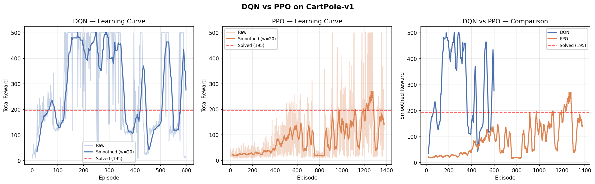

# RL Algorithms from Scratch

PyTorch implementations of foundational deep reinforcement learning algorithms, with training curves on classic control environments.

**Environment:** CartPole-v1 | **Framework:** PyTorch

---

## Implementations

### DQN — Deep Q-Network
*Mnih et al., 2015 (Nature)*

| Component | Implementation |
|-----------|---------------|
| Experience Replay | Random sampling from a fixed-size circular buffer to break temporal correlations |
| Target Network | Separate frozen Q-network synced every 100 steps to stabilize Bellman targets |
| ε-greedy | Decays 1.0 → 0.01 over training (decay=0.995 per episode) |
| Network | 2-layer MLP (128 hidden), MSE loss, Adam optimizer |

**Result:** Solved CartPole-v1 at episode 130 (avg reward ≥ 195 over 100 episodes). Final avg reward: 281.4 / 500.

### PPO — Proximal Policy Optimization
*Schulman et al., 2017*

| Component | Implementation |
|-----------|---------------|
| Architecture | Actor-Critic with shared Tanh backbone, separate policy/value heads |
| GAE | Generalized Advantage Estimation (λ=0.95) for variance-reduced advantage |
| Clipped Objective | ε=0.2 clip prevents destructively large policy updates |
| Update | 4 epochs per rollout, minibatch size 64, gradient clipping (norm=0.5) |

**Result:** Learns stable CartPole policy. Final avg reward: 143.4 / 500.



---

## Key Concepts

**Why DQN needs a Replay Buffer:**
Consecutive transitions are highly correlated — training on them directly causes the Q-network to overfit to recent experience and catastrophically forget earlier states. Random sampling from the buffer breaks this correlation.

**Why DQN needs a Target Network:**
Without it, both the predicted Q-value and the TD-target move simultaneously, causing the optimization to chase a moving target. The target network provides a stable Bellman backup for C steps.

**Why PPO clips the objective:**
Vanilla policy gradient updates can take steps that are too large, collapsing the policy. The clipped surrogate `min(r·A, clip(r, 1-ε, 1+ε)·A)` conservatively ignores large probability ratio changes, keeping updates trust-region safe without the complexity of TRPO.

**Why GAE matters:**
Pure Monte Carlo returns (λ=1) have high variance; pure TD (λ=0) has high bias. GAE interpolates between them via λ, offering a practical variance-bias tradeoff.

---

## Run

```bash
pip install -r requirements.txt
python train.py
# Results saved to results/training_curves.png
```

## Structure

```
├── algorithms/
│   ├── dqn.py        # QNetwork, ReplayBuffer, DQNAgent
│   └── ppo.py        # ActorCritic, PPOAgent (GAE + clipped objective)
├── train.py          # Training loops + comparison charts
├── results/
│   └── training_curves.png
└── 强化学习的数学原理 (赵世钰).pdf   # Reference: mathematical foundations
```

## Reference

- [DQN Paper](https://www.nature.com/articles/nature14236) — Mnih et al., 2015
- [PPO Paper](https://arxiv.org/abs/1707.06347) — Schulman et al., 2017
- 强化学习的数学原理 — 赵世钰 (mathematical foundations reference)
